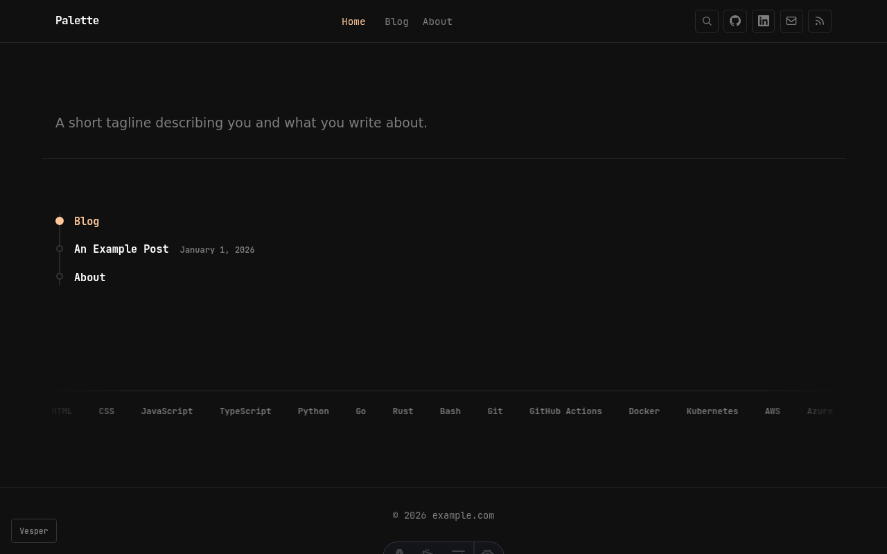
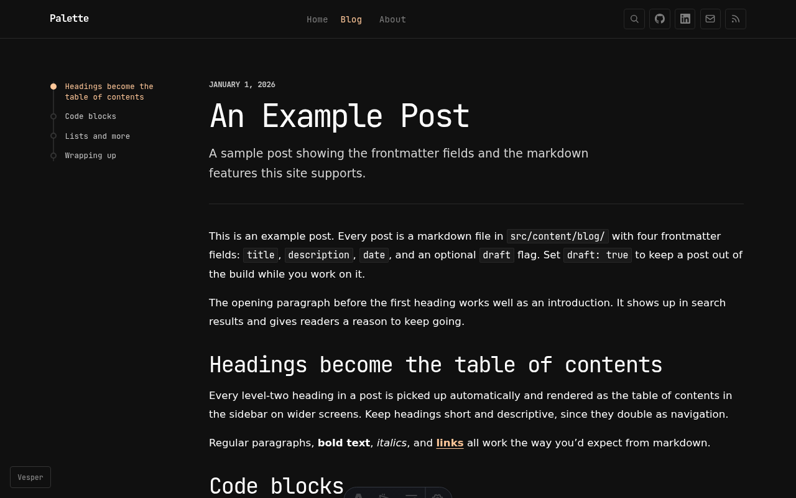
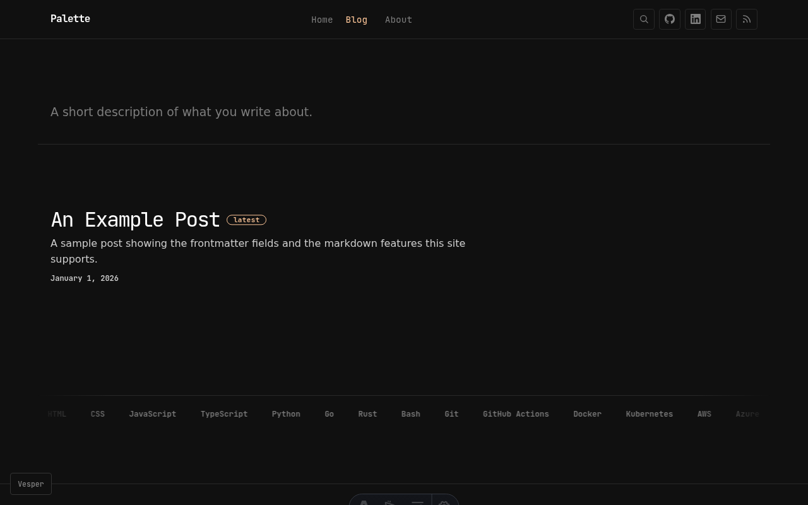
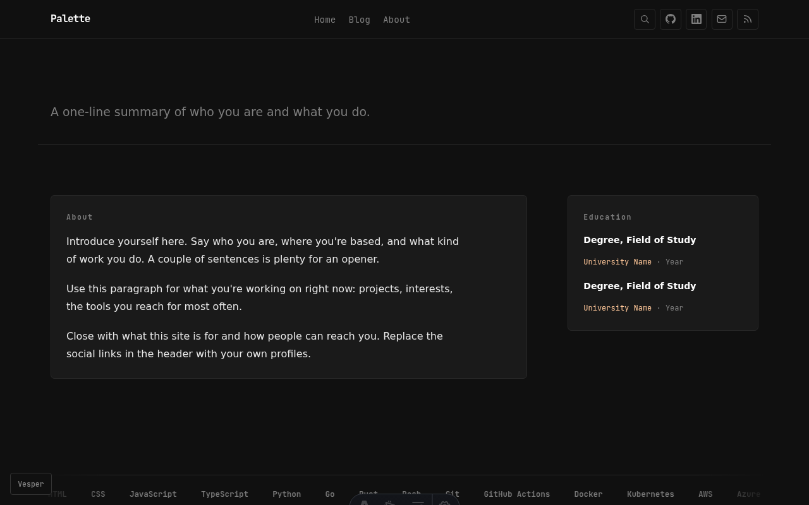
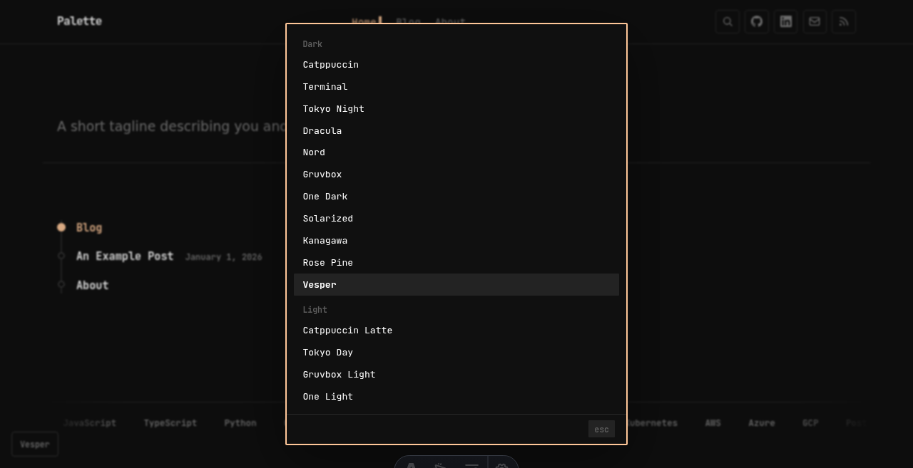
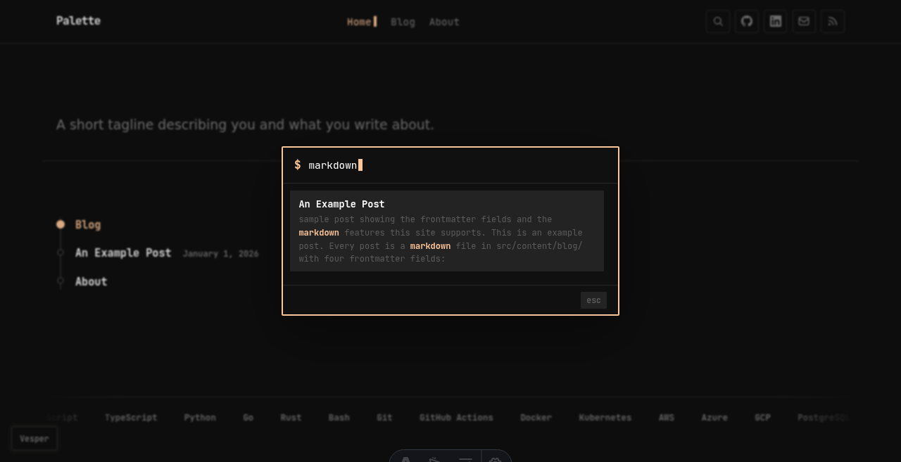

# Astro Palette

A blog and personal site theme for Astro with a terminal look and 18 switchable color palettes. The build output is fully static, with no client-side framework and no analytics.

**[Demo](https://astro-palette.8limb.dev/)**

Based on the website theme from [herdr](https://github.com/ogulcancelik/herdr) by Oğulcan Çelik, distributed under the same AGPL-3.0-or-later license.

## Screenshots





| Blog index | About |
| --- | --- |
|  |  |

| Theme switcher | Search (Ctrl/Cmd+K) |
| --- | --- |
|  |  |

## Features

- 18 color palettes (Catppuccin, Nord, Dracula, Gruvbox, Tokyo Night, Rosé Pine, Kanagawa, Solarized, and others), defined as plain CSS variables and switchable at runtime
- Home, blog, and about pages, an RSS feed, and a sitemap
- Tags: optional per-post tags, a browsable `/tags/` archive, and tag chips on posts
- Client-side search via [Pagefind](https://pagefind.app), opened with Ctrl/Cmd+K, with shell-style history recall on the arrow keys
- Table of contents on posts, generated from level-two headings
- Optional [Remark42](https://remark42.com) comments
- JetBrains Mono throughout, with code blocks highlighted to match the active palette

## Getting started

```sh
npm install
npm run dev       # dev server on :4321
npm run build     # astro build + pagefind index
npm run preview   # preview the production build
npm run check     # astro type checking
```

Search queries the Pagefind index in `dist/`, so run `npm run build` once before search will return results in dev.

## Customizing

The theme ships with placeholder values. Search the project for `example.com`, `Your Name`, `your-username`, and the `Palette` site name, and replace them in:

- `astro.config.mjs`: the `site` domain
- `src/components/Layout.astro`: site name, social links, footer
- `src/pages/index.astro`: tagline and person schema
- `src/pages/about.astro`: bio and education
- `src/lib/tags.ts`: skills list for the marquee, which also seeds the `/tags/` archive
- `src/pages/rss.xml.ts` and `src/pages/blog/[slug].astro`: feed and author metadata
- `public/robots.txt` and `public/.well-known/security.txt`: domain and contact
- `public/assets/og.png`: social preview image, 1200x630 (a plain placeholder is included)

Comments stay disabled unless you run a Remark42 instance. The configuration is at the bottom of `src/pages/blog/[slug].astro`; remove the comments section there if you don't want it.

## Writing posts

Posts are markdown files in `src/content/blog/` with `title`, `description`, `date`, optional `tags`, and optional `draft` frontmatter. Each tag links to its archive page under `/tags/`. `example-post.md` shows the frontmatter and the supported markdown.

## Project structure

```
src/
  components/     Layout (nav, search, theme switcher), TypedLede, SkillsMarquee
  content/blog/   posts as markdown
  lib/            tags: skills list and tag helpers
  pages/          index (home), blog/, tags/, about, 404, rss
public/
  css/style.css   all styling, including palette definitions
  assets/         font, og image
```

## License

[AGPL-3.0-or-later](LICENSE).

Credits:

- Base theme: [herdr](https://github.com/ogulcancelik/herdr) website theme (AGPL-3.0-or-later)
- Font: [JetBrains Mono](https://www.jetbrains.com/lp/mono/), under the [SIL Open Font License 1.1](https://github.com/JetBrains/JetBrainsMono/blob/master/OFL.txt)
- Search: [Pagefind](https://pagefind.app) (MIT)
